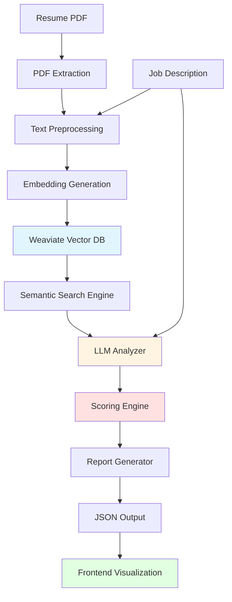

# Resume Intelligence Analysis System - Complete Design & Methodology

## Table of Contents
1. [System Overview](#system-overview)
2. [Architecture](#architecture)
3. [Data Flow](#data-flow)
4. [Component Details](#component-details)
5. [Scoring Methodology](#scoring-methodology)
6. [Highlighting Logic](#highlighting-logic)
7. [Implementation Guide](#implementation-guide)
8. [Example Output](#example-output)

---

## System Overview

The Resume Intelligence Analysis System is an AI-powered platform that evaluates resumes against job descriptions across 7 key dimensions:

1. **Skills Match** - Technical and soft skills alignment
2. **Impact/Contribution** - Quantifiable achievements and value delivery
3. **Roles & Responsibilities Fit** - Job duty alignment
4. **Achievements** - Relevance and recency of accomplishments
5. **Experience** - Years, domain expertise, and seniority level
6. **Personal Details** - Completeness and relevance of contact/profile info
7. **Hobbies/Extracurriculars** - Cultural fit and soft skill indicators

### Key Features
- **Semantic Understanding**: Uses embeddings to detect implicit skill mentions
- **Quantified Scoring**: 0-100% scores for each dimension
- **Actionable Insights**: Specific suggestions for improvement
- **Visual Highlighting**: Color-coded feedback (green/yellow/red)
- **Structured Output**: JSON format for easy integration

---

## Architecture

### High-Level Architecture



### Technology Stack

| Component | Technology | Purpose |
|-----------|-----------|---------|
| **PDF Extraction** | PyMuPDF (fitz) / pdfplumber | Extract text from resume PDFs |
| **Text Processing** | spaCy / NLTK | NLP preprocessing, entity extraction |
| **Embeddings** | OpenAI text-embedding-3-small | Convert text to vector representations |
| **Vector Database** | Weaviate | Store and search embeddings |
| **LLM Analysis** | OpenAI GPT-4 / Claude | Deep semantic analysis and scoring |
| **Backend API** | FastAPI | RESTful API endpoints |
| **Frontend** | React / Vue.js | Interactive dashboard |
| **Highlighting** | PDF.js + Canvas API | Visual annotations on PDF |

---

## Data Flow

### Step-by-Step Pipeline

#### 1. **Ingestion Phase**
```
Resume PDF + Job Description Text
         ↓
    PDF Extraction (PyMuPDF)
         ↓
    Text Cleaning & Normalization
         ↓
    Section Detection (Skills, Experience, etc.)
```

#### 2. **Embedding Phase**
```
Resume Sections → Chunk into semantic units
         ↓
    Generate Embeddings (OpenAI)
         ↓
    Store in Weaviate with metadata
         ↓
    JD Requirements → Embeddings
```

#### 3. **Analysis Phase**
```
For each evaluation dimension:
    ↓
    Semantic Search (Weaviate)
    ↓
    Retrieve relevant resume chunks
    ↓
    LLM Analysis (GPT-4)
    ↓
    Generate scores + reasoning
```

#### 4. **Reporting Phase**
```
Aggregate all dimension scores
         ↓
    Calculate overall match score
         ↓
    Generate structured JSON
         ↓
    Create highlight instructions
         ↓
    Return to frontend
```

---

## Component Details

### 1. PDF Extraction Module

**Purpose**: Extract structured text from resume PDFs while preserving layout information.

**Implementation**:
```python
import fitz  # PyMuPDF
from typing import Dict, List

class PDFExtractor:
    def __init__(self):
        self.section_keywords = {
            'skills': ['skills', 'technical skills', 'competencies'],
            'experience': ['experience', 'work history', 'employment'],
            'education': ['education', 'academic', 'qualifications'],
            'achievements': ['achievements', 'accomplishments', 'awards'],
            'projects': ['projects', 'portfolio'],
            'personal': ['contact', 'personal details', 'profile'],
            'hobbies': ['hobbies', 'interests', 'activities']
        }
    
    def extract_text(self, pdf_path: str) -> Dict[str, str]:
        """Extract text with section detection"""
        doc = fitz.open(pdf_path)
        full_text = ""
        
        for page in doc:
            full_text += page.get_text()
        
        return self._parse_sections(full_text)
    
    def _parse_sections(self, text: str) -> Dict[str, str]:
        """Detect and separate resume sections"""
        sections = {
            'raw_text': text,
            'skills': '',
            'experience': '',
            'education': '',
            'achievements': '',
            'projects': '',
            'personal': '',
            'hobbies': ''
        }
        
        lines = text.split('\n')
        current_section = None
        
        for line in lines:
            line_lower = line.lower().strip()
            
            # Detect section headers
            for section_name, keywords in self.section_keywords.items():
                if any(keyword in line_lower for keyword in keywords):
                    current_section = section_name
                    break
            
            # Append to current section
            if current_section:
                sections[current_section] += line + '\n'
        
        return sections
```

### 2. Embedding Generation Module

**Purpose**: Convert text into vector embeddings for semantic search.

**Implementation**:
```python
import openai
from typing import List, Dict
import numpy as np

class EmbeddingGenerator:
    def __init__(self, api_key: str):
        openai.api_key = api_key
        self.model = "text-embedding-3-small"
    
    def generate_embedding(self, text: str) -> List[float]:
        """Generate embedding for a single text"""
        response = openai.embeddings.create(
            input=text,
            model=self.model
        )
        return response.data[0].embedding
    
    def batch_generate(self, texts: List[str]) -> List[List[float]]:
        """Generate embeddings for multiple texts"""
        response = openai.embeddings.create(
            input=texts,
            model=self.model
        )
        return [item.embedding for item in response.data]
    
    def chunk_text(self, text: str, chunk_size: int = 500) -> List[str]:
        """Split text into semantic chunks"""
        # Simple sentence-based chunking
        sentences = text.split('. ')
        chunks = []
        current_chunk = ""
        
        for sentence in sentences:
            if len(current_chunk) + len(sentence) < chunk_size:
                current_chunk += sentence + '. '
            else:
                if current_chunk:
                    chunks.append(current_chunk.strip())
                current_chunk = sentence + '. '
        
        if current_chunk:
            chunks.append(current_chunk.strip())
        
        return chunks
```

### 3. Weaviate Integration Module

**Purpose**: Store and search resume embeddings semantically.

**Schema Design**:
```python
import weaviate
from typing import List, Dict

class WeaviateManager:
    def __init__(self, url: str):
        self.client = weaviate.Client(url)
        self._create_schema()
    
    def _create_schema(self):
        """Create Weaviate schema for resume data"""
        schema = {
            "classes": [
                {
                    "class": "ResumeChunk",
                    "description": "A chunk of resume text",
                    "vectorizer": "none",  # We provide embeddings
                    "properties": [
                        {
                            "name": "content",
                            "dataType": ["text"],
                            "description": "The actual text content"
                        },
                        {
                            "name": "section",
                            "dataType": ["string"],
                            "description": "Resume section (skills, experience, etc.)"
                        },
                        {
                            "name": "resume_id",
                            "dataType": ["string"],
                            "description": "Unique resume identifier"
                        },
                        {
                            "name": "metadata",
                            "dataType": ["text"],
                            "description": "Additional context as JSON"
                        }
                    ]
                },
                {
                    "class": "JobRequirement",
                    "description": "A requirement from job description",
                    "vectorizer": "none",
                    "properties": [
                        {
                            "name": "requirement",
                            "dataType": ["text"],
                            "description": "The requirement text"
                        },
                        {
                            "name": "category",
                            "dataType": ["string"],
                            "description": "Type: skill, responsibility, qualification"
                        },
                        {
                            "name": "jd_id",
                            "dataType": ["string"],
                            "description": "Job description identifier"
                        }
                    ]
                }
            ]
        }
        
        # Create schema if not exists
        try:
            self.client.schema.create(schema)
        except:
            pass  # Schema already exists
    
    def add_resume_chunks(self, chunks: List[Dict], embeddings: List[List[float]]):
        """Add resume chunks with embeddings"""
        with self.client.batch as batch:
            for chunk, embedding in zip(chunks, embeddings):
                batch.add_data_object(
                    data_object={
                        "content": chunk['content'],
                        "section": chunk['section'],
                        "resume_id": chunk['resume_id'],
                        "metadata": chunk.get('metadata', '{}')
                    },
                    class_name="ResumeChunk",
                    vector=embedding
                )
    
    def semantic_search(self, query_embedding: List[float], 
                       section_filter: str = None, 
                       limit: int = 5) -> List[Dict]:
        """Search for relevant resume chunks"""
        query = (
            self.client.query
            .get("ResumeChunk", ["content", "section", "metadata"])
            .with_near_vector({"vector": query_embedding})
            .with_limit(limit)
        )
        
        if section_filter:
            query = query.with_where({
                "path": ["section"],
                "operator": "Equal",
                "valueString": section_filter
            })
        
        result = query.do()
        return result.get('data', {}).get('Get', {}).get('ResumeChunk', [])
```

### 4. LLM Analyzer Module

**Purpose**: Deep semantic analysis using GPT-4 for scoring and insights.

**Implementation**:
```python
import openai
import json
from typing import Dict, List

class LLMAnalyzer:
    def __init__(self, api_key: str):
        openai.api_key = api_key
        self.model = "gpt-4-turbo-preview"
    
    def analyze_skills(self, resume_text: str, jd_text: str, 
                       semantic_matches: List[str]) -> Dict:
        """Analyze skills match"""
        prompt = f"""
You are a resume analysis expert. Analyze the skills match between this resume and job description.

RESUME:
{resume_text}

JOB DESCRIPTION:
{jd_text}

SEMANTIC MATCHES FOUND:
{json.dumps(semantic_matches, indent=2)}

Provide a JSON response with:
{{
  "score": 0-100,
  "matched_skills": ["skill1", "skill2"],
  "missing_skills": ["skill3", "skill4"],
  "mentioned_but_not_listed": ["skill5"],
  "comment": "Brief explanation",
  "suggestions": ["suggestion1", "suggestion2"]
}}

Be specific and evidence-based. Reference exact phrases from the resume.
"""
        
        response = openai.chat.completions.create(
            model=self.model,
            messages=[
                {"role": "system", "content": "You are a resume analysis expert."},
                {"role": "user", "content": prompt}
            ],
            response_format={"type": "json_object"},
            temperature=0.3
        )
        
        return json.loads(response.choices[0].message.content)
    
    def analyze_impact(self, resume_text: str, jd_text: str) -> Dict:
        """Analyze impact and contributions"""
        prompt = f"""
Analyze the impact and contributions in this resume against the job requirements.

RESUME:
{resume_text}

JOB DESCRIPTION:
{jd_text}

Look for:
- Quantifiable achievements (numbers, percentages, metrics)
- Business impact (revenue, cost savings, efficiency)
- Scale indicators (team size, user base, data volume)
- Leadership impact (mentoring, process improvements)

Return JSON:
{{
  "score": 0-100,
  "summary": "Overall impact assessment",
  "examples_found": [
    {{"achievement": "...", "impact": "...", "relevance": "high/medium/low"}}
  ],
  "missing_elements": ["What's missing"],
  "suggestions": ["How to improve"]
}}
"""
        
        response = openai.chat.completions.create(
            model=self.model,
            messages=[
                {"role": "system", "content": "You are a resume analysis expert."},
                {"role": "user", "content": prompt}
            ],
            response_format={"type": "json_object"},
            temperature=0.3
        )
        
        return json.loads(response.choices[0].message.content)
    
    def analyze_roles_responsibilities(self, resume_text: str, jd_text: str) -> Dict:
        """Analyze roles and responsibilities fit"""
        prompt = f"""
Extract key roles and responsibilities from the JD and match them to the resume.

RESUME:
{resume_text}

JOB DESCRIPTION:
{jd_text}

Return JSON:
{{
  "score": 0-100,
  "matched": [
    {{"jd_requirement": "...", "resume_evidence": "...", "match_quality": "strong/moderate/weak"}}
  ],
  "missing": ["Responsibility not covered"],
  "suggestions": ["How to address gaps"]
}}
"""
        
        response = openai.chat.completions.create(
            model=self.model,
            messages=[
                {"role": "system", "content": "You are a resume analysis expert."},
                {"role": "user", "content": prompt}
            ],
            response_format={"type": "json_object"},
            temperature=0.3
        )
        
        return json.loads(response.choices[0].message.content)
    
    def analyze_achievements(self, resume_text: str, jd_text: str) -> Dict:
        """Analyze achievements relevance"""
        prompt = f"""
Evaluate the achievements in the resume for relevance to this job.

RESUME:
{resume_text}

JOB DESCRIPTION:
{jd_text}

Assess:
- Relevance to the target role
- Recency (recent achievements more valuable)
- Quantifiability and impact
- Alignment with JD priorities

Return JSON:
{{
  "score": 0-100,
  "relevant": [
    {{"achievement": "...", "why_relevant": "...", "strength": "high/medium/low"}}
  ],
  "irrelevant": [
    {{"achievement": "...", "why_irrelevant": "..."}}
  ],
  "suggestions": ["What to add/emphasize/remove"]
}}
"""
        
        response = openai.chat.completions.create(
            model=self.model,
            messages=[
                {"role": "system", "content": "You are a resume analysis expert."},
                {"role": "user", "content": prompt}
            ],
            response_format={"type": "json_object"},
            temperature=0.3
        )
        
        return json.loads(response.choices[0].message.content)
    
    def analyze_experience(self, resume_text: str, jd_text: str) -> Dict:
        """Analyze experience fit"""
        prompt = f"""
Analyze the candidate's experience against job requirements.

RESUME:
{resume_text}

JOB DESCRIPTION:
{jd_text}

Evaluate:
- Total years of experience
- Relevant domain experience
- Seniority level match
- Technology/tool experience
- Industry experience

Return JSON:
{{
  "score": 0-100,
  "resume_experience_summary": "X years total, Y years in domain Z",
  "jd_experience_requirement": "What JD asks for",
  "gap_analysis": "Where experience falls short or exceeds",
  "suggestions": ["How to better present experience"]
}}
"""
        
        response = openai.chat.completions.create(
            model=self.model,
            messages=[
                {"role": "system", "content": "You are a resume analysis expert."},
                {"role": "user", "content": prompt}
            ],
            response_format={"type": "json_object"},
            temperature=0.3
        )
        
        return json.loads(response.choices[0].message.content)
    
    def analyze_personal_details(self, resume_text: str, jd_text: str) -> Dict:
        """Analyze personal details completeness"""
        prompt = f"""
Evaluate the personal/contact details section.

RESUME:
{resume_text}

JOB DESCRIPTION:
{jd_text}

Check for:
- Email, phone (essential)
- LinkedIn profile (highly recommended)
- GitHub/portfolio (for tech roles)
- Location (if relevant)
- Irrelevant info (DOB, gender, photo, nationality - unless required)

Return JSON:
{{
  "score": 0-100,
  "missing": ["LinkedIn", "GitHub"],
  "irrelevant": ["Date of birth"],
  "suggestions": ["Add professional LinkedIn URL", "Remove DOB"]
}}
"""
        
        response = openai.chat.completions.create(
            model=self.model,
            messages=[
                {"role": "system", "content": "You are a resume analysis expert."},
                {"role": "user", "content": prompt}
            ],
            response_format={"type": "json_object"},
            temperature=0.3
        )
        
        return json.loads(response.choices[0].message.content)
    
    def analyze_hobbies(self, resume_text: str, jd_text: str) -> Dict:
        """Analyze hobbies and extracurriculars"""
        prompt = f"""
Evaluate hobbies and extracurricular activities for job relevance.

RESUME:
{resume_text}

JOB DESCRIPTION:
{jd_text}

Consider:
- Soft skills demonstrated (leadership, teamwork, creativity)
- Cultural fit indicators
- Relevance to role (e.g., tech blogging for developer role)
- Generic vs. distinctive activities

Return JSON:
{{
  "score": 0-100,
  "relevant": [
    {{"activity": "...", "why_relevant": "..."}}
  ],
  "irrelevant": [
    {{"activity": "...", "why_irrelevant": "..."}}
  ],
  "suggestions": ["Keep/remove/add specific activities"]
}}
"""
        
        response = openai.chat.completions.create(
            model=self.model,
            messages=[
                {"role": "system", "content": "You are a resume analysis expert."},
                {"role": "user", "content": prompt}
            ],
            response_format={"type": "json_object"},
            temperature=0.3
        )
        
        return json.loads(response.choices[0].message.content)
```

### 5. Scoring Engine

**Purpose**: Aggregate dimension scores into overall match score.

**Scoring Methodology**:

```python
class ScoringEngine:
    def __init__(self):
        # Weights for different dimensions (must sum to 1.0)
        self.weights = {
            'skills': 0.25,           # 25% - Most critical
            'experience': 0.20,        # 20% - Very important
            'roles_responsibilities': 0.20,  # 20% - Core fit
            'impact': 0.15,           # 15% - Differentiator
            'achievements': 0.10,      # 10% - Nice to have
            'personal_details': 0.05,  # 5% - Basic requirement
            'hobbies': 0.05           # 5% - Cultural fit
        }
    
    def calculate_overall_score(self, dimension_scores: Dict[str, float]) -> float:
        """Calculate weighted overall score"""
        overall = 0.0
        
        for dimension, weight in self.weights.items():
            score = dimension_scores.get(dimension, 0)
            overall += score * weight
        
        return round(overall, 1)
    
    def get_match_category(self, score: float) -> str:
        """Categorize match strength"""
        if score >= 85:
            return "Excellent Match"
        elif score >= 70:
            return "Strong Match"
        elif score >= 55:
            return "Moderate Match"
        elif score >= 40:
            return "Weak Match"
        else:
            return "Poor Match"
    
    def generate_summary(self, overall_score: float, 
                        dimension_scores: Dict[str, float]) -> str:
        """Generate executive summary"""
        category = self.get_match_category(overall_score)
        
        # Find strengths and weaknesses
        strengths = [k for k, v in dimension_scores.items() if v >= 75]
        weaknesses = [k for k, v in dimension_scores.items() if v < 50]
        
        summary = f"{category} ({overall_score}%). "
        
        if strengths:
            summary += f"Strong in {', '.join(strengths)}. "
        
        if weaknesses:
            summary += f"Needs improvement in {', '.join(weaknesses)}."
        
        return summary
```

---

## Scoring Methodology

### Dimension-Specific Scoring Logic

#### 1. Skills Match (0-100%)

**Formula**:
```
Score = (Matched Skills / Required Skills) × 70 + 
        (Implicit Mentions / Total Skills) × 20 + 
        (Skill Depth Bonus) × 10
```

**Criteria**:
- **90-100%**: All required skills present, many mentioned in context
- **70-89%**: Most required skills present, some gaps
- **50-69%**: Half of required skills present
- **Below 50%**: Major skill gaps

**Example**:
- JD requires: Python, Django, REST APIs, PostgreSQL, Docker (5 skills)
- Resume has: Python (explicit), Django (explicit), REST APIs (in projects), PostgreSQL (missing), Docker (missing)
- Matched: 3/5 = 60%
- Implicit: 1/5 = 20%
- Score: (3/5 × 70) + (1/5 × 20) = 42 + 4 = **46%**

#### 2. Impact/Contribution (0-100%)

**Criteria**:
- **90-100%**: Multiple quantified achievements with clear business impact
- **70-89%**: Several achievements, some quantified
- **50-69%**: Achievements present but mostly qualitative
- **Below 50%**: Vague or no measurable impact

**Scoring Factors**:
- Presence of metrics (30 points)
- Business impact relevance (30 points)
- Scale indicators (20 points)
- Recency (20 points)

#### 3. Roles & Responsibilities (0-100%)

**Formula**:
```
Score = (Matched Responsibilities / Total JD Responsibilities) × 100
```

**Quality Adjustment**:
- Strong match (exact or very similar): 100% credit
- Moderate match (related but not exact): 60% credit
- Weak match (tangentially related): 30% credit

#### 4. Achievements (0-100%)

**Scoring**:
- Relevance to JD (50 points)
- Recency (25 points)
- Quantifiability (25 points)

#### 5. Experience (0-100%)

**Criteria**:
- Years match: ±1 year = 100%, ±2 years = 80%, ±3 years = 60%
- Domain match: Same domain = 100%, Related = 70%, Different = 30%
- Seniority match: Exact = 100%, One level off = 70%, Two+ levels = 40%

**Formula**:
```
Score = (Years Match × 0.4) + (Domain Match × 0.4) + (Seniority Match × 0.2)
```

#### 6. Personal Details (0-100%)

**Checklist**:
- Email: 20 points
- Phone: 20 points
- LinkedIn: 25 points
- Portfolio/GitHub (if relevant): 25 points
- Location (if relevant): 10 points
- Deduct 5 points for each irrelevant detail

#### 7. Hobbies (0-100%)

**Scoring**:
- Relevant activities that demonstrate job-related skills: +20 each (max 80)
- Generic activities: +5 each (max 20)
- Irrelevant activities: -10 each

---

## Highlighting Logic

### Color Coding System

| Color | Meaning | When to Apply |
|-------|---------|---------------|
| 🟢 **Green** | Keep/Emphasize | - Matched skills<br>- Strong achievements<br>- Relevant experience<br>- High-impact contributions |
| 🟡 **Yellow** | Improve/Add | - Skills mentioned but not in Skills section<br>- Weak impact statements<br>- Missing quantification<br>- Outdated achievements |
| 🔴 **Red** | Remove/Irrelevant | - Irrelevant hobbies<br>- Outdated technologies<br>- Unnecessary personal info<br>- Off-topic achievements |

### Highlighting Rules

```python
class HighlightGenerator:
    def generate_highlights(self, analysis_result: Dict) -> Dict:
        """Generate highlighting instructions"""
        highlights = {
            'green': [],
            'yellow': [],
            'red': []
        }
        
        # Green: Strong matches
        highlights['green'].extend([
            f"Skill: {skill}" for skill in analysis_result['sections']['skills']['matched_skills']
        ])
        highlights['green'].extend([
            f"Achievement: {ach['achievement']}" 
            for ach in analysis_result['sections']['achievements']['relevant']
            if ach.get('strength') == 'high'
        ])
        
        # Yellow: Improvements needed
        highlights['yellow'].extend([
            f"Add to Skills section: {skill}" 
            for skill in analysis_result['sections']['skills']['mentioned_but_not_listed']
        ])
        highlights['yellow'].extend([
            f"Quantify: {ex['achievement']}" 
            for ex in analysis_result['sections']['impact']['examples_found']
            if 'quantify' in ex.get('suggestion', '').lower()
        ])
        
        # Red: Remove
        highlights['red'].extend([
            f"Remove irrelevant: {item}" 
            for item in analysis_result['sections']['hobbies']['irrelevant']
        ])
        highlights['red'].extend([
            f"Remove: {detail}" 
            for detail in analysis_result['sections']['personal_details']['irrelevant']
        ])
        
        return highlights
```

---

## Implementation Guide

### FastAPI Backend

```python
from fastapi import FastAPI, UploadFile, File, Form
from fastapi.middleware.cors import CORSMiddleware
from pydantic import BaseModel
import tempfile
import os

app = FastAPI(title="Resume Intelligence API")

# CORS
app.add_middleware(
    CORSMiddleware,
    allow_origins=["*"],
    allow_methods=["*"],
    allow_headers=["*"],
)

# Initialize components
pdf_extractor = PDFExtractor()
embedding_gen = EmbeddingGenerator(api_key=os.getenv("OPENAI_API_KEY"))
weaviate_mgr = WeaviateManager(url=os.getenv("WEAVIATE_URL"))
llm_analyzer = LLMAnalyzer(api_key=os.getenv("OPENAI_API_KEY"))
scoring_engine = ScoringEngine()

class AnalysisRequest(BaseModel):
    jd_text: str

@app.post("/api/analyze")
async def analyze_resume(
    resume: UploadFile = File(...),
    jd_text: str = Form(...)
):
    """Main endpoint for resume analysis"""
    
    # 1. Extract resume text
    with tempfile.NamedTemporaryFile(delete=False, suffix='.pdf') as tmp:
        tmp.write(await resume.read())
        tmp_path = tmp.name
    
    resume_sections = pdf_extractor.extract_text(tmp_path)
    os.unlink(tmp_path)
    
    # 2. Generate embeddings
    resume_chunks = []
    for section, content in resume_sections.items():
        if section != 'raw_text' and content.strip():
            chunks = embedding_gen.chunk_text(content)
            for chunk in chunks:
                resume_chunks.append({
                    'content': chunk,
                    'section': section,
                    'resume_id': resume.filename
                })
    
    chunk_texts = [c['content'] for c in resume_chunks]
    embeddings = embedding_gen.batch_generate(chunk_texts)
    
    # 3. Store in Weaviate
    weaviate_mgr.add_resume_chunks(resume_chunks, embeddings)
    
    # 4. Analyze each dimension
    analyses = {}
    
    # Skills
    skill_query_emb = embedding_gen.generate_embedding(
        f"technical skills and competencies: {jd_text}"
    )
    skill_matches = weaviate_mgr.semantic_search(
        skill_query_emb, 
        section_filter='skills',
        limit=10
    )
    analyses['skills'] = llm_analyzer.analyze_skills(
        resume_sections['raw_text'],
        jd_text,
        [m['content'] for m in skill_matches]
    )
    
    # Impact
    analyses['impact'] = llm_analyzer.analyze_impact(
        resume_sections['raw_text'],
        jd_text
    )
    
    # Roles & Responsibilities
    analyses['roles_responsibilities'] = llm_analyzer.analyze_roles_responsibilities(
        resume_sections['raw_text'],
        jd_text
    )
    
    # Achievements
    analyses['achievements'] = llm_analyzer.analyze_achievements(
        resume_sections['raw_text'],
        jd_text
    )
    
    # Experience
    analyses['experience'] = llm_analyzer.analyze_experience(
        resume_sections['raw_text'],
        jd_text
    )
    
    # Personal Details
    analyses['personal_details'] = llm_analyzer.analyze_personal_details(
        resume_sections['raw_text'],
        jd_text
    )
    
    # Hobbies
    analyses['hobbies'] = llm_analyzer.analyze_hobbies(
        resume_sections['raw_text'],
        jd_text
    )
    
    # 5. Calculate overall score
    dimension_scores = {k: v['score'] for k, v in analyses.items()}
    overall_score = scoring_engine.calculate_overall_score(dimension_scores)
    summary = scoring_engine.generate_summary(overall_score, dimension_scores)
    
    # 6. Generate highlights
    highlight_gen = HighlightGenerator()
    full_result = {
        'overall_match_score': overall_score,
        'summary': summary,
        'sections': analyses
    }
    highlights = highlight_gen.generate_highlights(full_result)
    
    # 7. Return complete report
    return {
        **full_result,
        'highlight_instructions': highlights
    }

@app.get("/health")
async def health_check():
    return {"status": "healthy"}
```

### Frontend Integration Example

```javascript
// React component for resume analysis

import React, { useState } from 'react';
import axios from 'axios';

function ResumeAnalyzer() {
  const [resume, setResume] = useState(null);
  const [jdText, setJdText] = useState('');
  const [result, setResult] = useState(null);
  const [loading, setLoading] = useState(false);

  const handleAnalyze = async () => {
    if (!resume || !jdText) {
      alert('Please provide both resume and job description');
      return;
    }

    setLoading(true);
    const formData = new FormData();
    formData.append('resume', resume);
    formData.append('jd_text', jdText);

    try {
      const response = await axios.post(
        'http://localhost:8000/api/analyze',
        formData,
        {
          headers: { 'Content-Type': 'multipart/form-data' }
        }
      );
      setResult(response.data);
    } catch (error) {
      console.error('Analysis failed:', error);
      alert('Analysis failed. Please try again.');
    } finally {
      setLoading(false);
    }
  };

  const getScoreColor = (score) => {
    if (score >= 75) return 'text-green-600';
    if (score >= 50) return 'text-yellow-600';
    return 'text-red-600';
  };

  return (
    <div className="container mx-auto p-6">
      <h1 className="text-3xl font-bold mb-6">Resume Intelligence Analyzer</h1>
      
      {/* Input Section */}
      <div className="mb-6">
        <label className="block mb-2 font-semibold">Upload Resume (PDF)</label>
        <input
          type="file"
          accept=".pdf"
          onChange={(e) => setResume(e.target.files[0])}
          className="border p-2 rounded w-full"
        />
      </div>

      <div className="mb-6">
        <label className="block mb-2 font-semibold">Job Description</label>
        <textarea
          value={jdText}
          onChange={(e) => setJdText(e.target.value)}
          rows={10}
          className="border p-2 rounded w-full"
          placeholder="Paste job description here..."
        />
      </div>

      <button
        onClick={handleAnalyze}
        disabled={loading}
        className="bg-blue-600 text-white px-6 py-2 rounded hover:bg-blue-700 disabled:bg-gray-400"
      >
        {loading ? 'Analyzing...' : 'Analyze Resume'}
      </button>

      {/* Results Section */}
      {result && (
        <div className="mt-8">
          <div className="bg-white shadow-lg rounded-lg p-6 mb-6">
            <h2 className="text-2xl font-bold mb-4">Analysis Results</h2>
            <div className="mb-4">
              <span className="text-lg font-semibold">Overall Match: </span>
              <span className={`text-2xl font-bold ${getScoreColor(result.overall_match_score)}`}>
                {result.overall_match_score}%
              </span>
            </div>
            <p className="text-gray-700">{result.summary}</p>
          </div>

          {/* Section Scores */}
          <div className="grid grid-cols-1 md:grid-cols-2 lg:grid-cols-3 gap-4 mb-6">
            {Object.entries(result.sections).map(([section, data]) => (
              <div key={section} className="bg-white shadow rounded-lg p-4">
                <h3 className="font-bold text-lg mb-2 capitalize">
                  {section.replace('_', ' ')}
                </h3>
                <div className={`text-3xl font-bold ${getScoreColor(data.score)}`}>
                  {data.score}%
                </div>
                {data.comment && (
                  <p className="text-sm text-gray-600 mt-2">{data.comment}</p>
                )}
              </div>
            ))}
          </div>

          {/* Detailed Sections */}
          {Object.entries(result.sections).map(([section, data]) => (
            <div key={section} className="bg-white shadow-lg rounded-lg p-6 mb-6">
              <h3 className="text-xl font-bold mb-4 capitalize">
                {section.replace('_', ' ')} Details
              </h3>
              
              {/* Skills Section */}
              {section === 'skills' && (
                <>
                  <div className="mb-4">
                    <h4 className="font-semibold text-green-600 mb-2">✓ Matched Skills</h4>
                    <div className="flex flex-wrap gap-2">
                      {data.matched_skills.map((skill, idx) => (
                        <span key={idx} className="bg-green-100 text-green-800 px-3 py-1 rounded">
                          {skill}
                        </span>
                      ))}
                    </div>
                  </div>
                  <div className="mb-4">
                    <h4 className="font-semibold text-red-600 mb-2">✗ Missing Skills</h4>
                    <div className="flex flex-wrap gap-2">
                      {data.missing_skills.map((skill, idx) => (
                        <span key={idx} className="bg-red-100 text-red-800 px-3 py-1 rounded">
                          {skill}
                        </span>
                      ))}
                    </div>
                  </div>
                  <div className="mb-4">
                    <h4 className="font-semibold text-yellow-600 mb-2">⚠ Mentioned but Not Listed</h4>
                    <div className="flex flex-wrap gap-2">
                      {data.mentioned_but_not_listed.map((skill, idx) => (
                        <span key={idx} className="bg-yellow-100 text-yellow-800 px-3 py-1 rounded">
                          {skill}
                        </span>
                      ))}
                    </div>
                  </div>
                </>
              )}

              {/* Suggestions */}
              {data.suggestions && data.suggestions.length > 0 && (
                <div className="mt-4">
                  <h4 className="font-semibold mb-2">💡 Suggestions</h4>
                  <ul className="list-disc list-inside space-y-1">
                    {data.suggestions.map((suggestion, idx) => (
                      <li key={idx} className="text-gray-700">{suggestion}</li>
                    ))}
                  </ul>
                </div>
              )}
            </div>
          ))}

          {/* Highlight Instructions */}
          <div className="bg-white shadow-lg rounded-lg p-6">
            <h3 className="text-xl font-bold mb-4">Highlighting Guide</h3>
            <div className="grid grid-cols-1 md:grid-cols-3 gap-4">
              <div>
                <h4 className="font-semibold text-green-600 mb-2">🟢 Keep/Emphasize</h4>
                <ul className="text-sm space-y-1">
                  {result.highlight_instructions.green.map((item, idx) => (
                    <li key={idx}>{item}</li>
                  ))}
                </ul>
              </div>
              <div>
                <h4 className="font-semibold text-yellow-600 mb-2">🟡 Improve/Add</h4>
                <ul className="text-sm space-y-1">
                  {result.highlight_instructions.yellow.map((item, idx) => (
                    <li key={idx}>{item}</li>
                  ))}
                </ul>
              </div>
              <div>
                <h4 className="font-semibold text-red-600 mb-2">🔴 Remove</h4>
                <ul className="text-sm space-y-1">
                  {result.highlight_instructions.red.map((item, idx) => (
                    <li key={idx}>{item}</li>
                  ))}
                </ul>
              </div>
            </div>
          </div>
        </div>
      )}
    </div>
  );
}

export default ResumeAnalyzer;
```

---

## Example Output

### Complete JSON Report Example

```json
{
  "overall_match_score": 72.5,
  "summary": "Strong Match (72.5%). Strong in skills, experience, roles_responsibilities. Needs improvement in impact, personal_details.",
  "sections": {
    "skills": {
      "score": 78,
      "matched_skills": [
        "Python",
        "Django",
        "REST APIs",
        "PostgreSQL",
        "Git",
        "Agile/Scrum",
        "Unit Testing"
      ],
      "missing_skills": [
        "Docker",
        "Kubernetes",
        "CI/CD (Jenkins/GitLab CI)",
        "Redis",
        "Celery"
      ],
      "mentioned_but_not_listed": [
        "AWS (mentioned in project description)",
        "React (mentioned in full-stack project)"
      ],
      "comment": "Strong technical foundation with 7/12 required skills explicitly listed. Missing containerization and some DevOps tools. AWS and React are mentioned in context but should be added to Skills section.",
      "suggestions": [
        "Add 'Docker' and 'Kubernetes' to Skills section if you have any experience, even basic",
        "Move 'AWS' and 'React' from project descriptions to the Skills section",
        "Consider adding 'CI/CD' if you've worked with any pipeline tools",
        "Highlight 'PostgreSQL' more prominently as it's a key requirement"
      ]
    },
    "impact": {
      "score": 65,
      "summary": "Moderate impact demonstration. Some quantified achievements present but could be strengthened with more specific metrics and business outcomes.",
      "examples_found": [
        {
          "achievement": "Improved API response time by 40%",
          "impact": "Performance optimization",
          "relevance": "high",
          "suggestion": "Add context: how many users affected, what was baseline time"
        },
        {
          "achievement": "Led team of 3 developers",
          "impact": "Leadership",
          "relevance": "medium",
          "suggestion": "Quantify outcome: what did the team deliver, in what timeframe"
        },
        {
          "achievement": "Implemented automated testing suite",
          "impact": "Quality improvement",
          "relevance": "high",
          "suggestion": "Add metrics: test coverage %, bugs reduced by X%, deployment frequency increased"
        }
      ],
      "missing_elements": [
        "Business impact metrics (revenue, cost savings, user growth)",
        "Scale indicators (data volume, request throughput, user base size)",
        "Time-to-market improvements",
        "Customer satisfaction metrics"
      ],
      "suggestions": [
        "Rewrite '40% API improvement' as: 'Optimized API endpoints serving 100K+ daily requests, reducing average response time from 800ms to 480ms (40% improvement), improving user experience for 50K active users'",
        "Add business context to technical achievements",
        "Quantify the automated testing impact: 'Implemented pytest-based testing suite achieving 85% code coverage, reducing production bugs by 60% and enabling weekly releases'",
        "Include at least one achievement showing business/revenue impact if applicable"
      ]
    },
    "roles_and_responsibilities": {
      "score": 75,
      "matched": [
        {
          "jd_requirement": "Design and develop RESTful APIs",
          "resume_evidence": "Developed REST APIs using Django REST Framework for e-commerce platform",
          "match_quality": "strong"
        },
        {
          "jd_requirement": "Write clean, maintainable code following best practices",
          "resume_evidence": "Implemented PEP 8 standards, code reviews, and comprehensive documentation",
          "match_quality": "strong"
        },
        {
          "jd_requirement": "Collaborate with cross-functional teams",
          "resume_evidence": "Worked with frontend developers, designers, and product managers in Agile sprints",
          "match_quality": "strong"
        },
        {
          "jd_requirement": "Optimize database queries and application performance",
          "resume_evidence": "Optimized PostgreSQL queries, implemented caching, improved API response times",
          "match_quality": "strong"
        },
        {
          "jd_requirement": "Participate in code reviews and mentor junior developers",
          "resume_evidence": "Led team of 3 developers, conducted code reviews",
          "match_quality": "moderate"
        },
        {
          "jd_requirement": "Implement CI/CD pipelines",
          "resume_evidence": "Not explicitly mentioned",
          "match_quality": "weak"
        }
      ],
      "missing": [
        "Deploy and maintain applications in containerized environments (Docker/K8s)",
        "Implement monitoring and logging solutions",
        "Handle incident response and troubleshooting in production"
      ],
      "suggestions": [
        "Add any experience with deployment, even if manual: 'Deployed applications to AWS EC2 instances'",
        "Mention any monitoring tools used: 'Monitored application health using CloudWatch/Sentry'",
        "Expand on mentoring: specific examples of how you helped junior developers grow",
        "If you've set up any automated deployments, highlight that prominently"
      ]
    },
    "achievements": {
      "score": 70,
      "relevant": [
        {
          "achievement": "Improved API response time by 40% through query optimization and caching",
          "why_relevant": "Directly aligns with JD requirement for performance optimization",
          "strength": "high"
        },
        {
          "achievement": "Implemented automated testing suite with 85% code coverage",
          "why_relevant": "Shows commitment to code quality, a key JD requirement",
          "strength": "high"
        },
        {
          "achievement": "Led migration from monolithic to microservices architecture",
          "why_relevant": "Demonstrates architectural skills and experience with modern patterns",
          "strength": "medium"
        },
        {
          "achievement": "Awarded 'Employee of the Quarter' Q2 2023",
          "why_relevant": "Shows recognition but lacks technical specificity",
          "strength": "low"
        }
      ],
      "irrelevant": [
        {
          "achievement": "Completed Java certification in 2018",
          "why_irrelevant": "Outdated (5+ years) and Java is not required for this Python role"
        },
        {
          "achievement": "Won college hackathon in 2019",
          "why_irrelevant": "Too old and not professional experience; remove unless very prestigious"
        }
      ],
      "suggestions": [
        "Remove or de-emphasize the Java certification and college hackathon",
        "Expand on the microservices migration: what was the impact, how many services, what challenges overcome",
        "Add more recent achievements from the last 1-2 years",
        "Replace generic 'Employee of Quarter' with specific technical achievement that earned it",
        "Consider adding: contributions to open source, tech talks given, or process improvements implemented"
      ]
    },
    "experience": {
      "score": 80,
      "resume_experience_summary": "5 years total experience, 4 years in backend development with Python/Django, 2 years in e-commerce domain, mid-level seniority",
      "jd_experience_requirement": "3-5 years of backend development experience with Python, preferably in e-commerce or high-traffic applications",
      "gap_analysis": "Experience level matches well. 5 years total with 4 years Python/Django exceeds the 3-year minimum and fits within the 3-5 year range. E-commerce domain experience (2 years) is a strong plus. Seniority appears appropriate for the role.",
      "suggestions": [
        "Emphasize the e-commerce experience more prominently as it's a preferred qualification",
        "Highlight any high-traffic application experience (mention user numbers, request volumes)",
        "Consider adding a summary statement: 'Backend Engineer with 5 years experience building scalable Python/Django applications, including 2 years in e-commerce platforms serving 100K+ users'",
        "Ensure experience section shows progression: junior → mid-level roles with increasing responsibility"
      ]
    },
    "personal_details": {
      "score": 60,
      "missing": [
        "LinkedIn profile URL",
        "GitHub profile (highly recommended for developer roles)",
        "Portfolio or personal website",
        "Location/timezone (if remote role)"
      ],
      "irrelevant": [
        "Date of birth (not needed, may introduce bias)",
        "Marital status (irrelevant for job)",
        "Nationality (unless visa sponsorship is a factor)"
      ],
      "suggestions": [
        "Add LinkedIn URL: 'linkedin.com/in/yourprofile'",
        "Add GitHub URL: 'github.com/yourusername' - essential for developer roles",
        "Remove date of birth, marital status, and nationality",
        "If remote role, add: 'Location: City, Country (UTC+X) | Open to remote work'",
        "Consider adding: personal blog or portfolio site if you have one"
      ]
    },
    "hobbies": {
      "score": 55,
      "relevant": [
        {
          "activity": "Contributing to open-source Python projects",
          "why_relevant": "Directly demonstrates technical skills and community involvement"
        },
        {
          "activity": "Technical blogging about Django best practices",
          "why_relevant": "Shows expertise, communication skills, and thought leadership"
        },
        {
          "activity": "Participating in local Python meetups",
          "why_relevant": "Demonstrates continuous learning and networking in relevant community"
        }
      ],
      "irrelevant": [
        {
          "activity": "Reading fiction novels",
          "why_irrelevant": "Generic hobby, doesn't differentiate or show job-relevant skills"
        },
        {
          "activity": "Watching movies",
          "why_irrelevant": "Too generic, doesn't add value to application"
        },
        {
          "activity": "Traveling",
          "why_irrelevant": "Common hobby, doesn't demonstrate skills relevant to backend development"
        }
      ],
      "suggestions": [
        "Keep: open-source contributions, technical blogging, Python meetups - these are excellent",
        "Remove: reading fiction, watching movies, traveling - too generic",
        "Consider adding: 'Building side projects' with link to GitHub repos",
        "If you mentor others, add: 'Mentoring aspiring developers through Code.org'",
        "Competitive programming or hackathons (if recent) would be relevant",
        "Keep this section brief - 2-3 relevant items maximum"
      ]
    }
  },
  "highlight_instructions": {
    "green": [
      "Skill: Python - keep and emphasize",
      "Skill: Django - keep and emphasize",
      "Skill: REST APIs - keep and emphasize",
      "Skill: PostgreSQL - keep and emphasize",
      "Achievement: Improved API response time by 40%",
      "Achievement: Implemented automated testing suite",
      "Experience: 4 years Python/Django development",
      "Experience: 2 years e-commerce domain",
      "Hobby: Contributing to open-source Python projects",
      "Hobby: Technical blogging about Django",
      "Responsibility: Developed REST APIs using Django REST Framework"
    ],
    "yellow": [
      "Add to Skills section: AWS (currently only in project description)",
      "Add to Skills section: React (currently only in project description)",
      "Add to Skills section: Docker (if any experience)",
      "Add to Skills section: CI/CD tools (if any experience)",
      "Quantify: 'Improved API response time by 40%' - add baseline, user impact, scale",
      "Quantify: 'Led team of 3 developers' - add outcomes, deliverables, timeframe",
      "Quantify: 'Automated testing suite' - add coverage %, bug reduction, deployment frequency",
      "Expand: Microservices migration achievement - add impact and challenges",
      "Add: LinkedIn profile URL",
      "Add: GitHub profile URL",
      "Add: Business impact metrics to at least one achievement",
      "Improve: Replace 'Employee of Quarter' with specific technical achievement"
    ],
    "red": [
      "Remove irrelevant: Date of birth",
      "Remove irrelevant: Marital status",
      "Remove irrelevant: Nationality (unless visa relevant)",
      "Remove irrelevant: Reading fiction novels",
      "Remove irrelevant: Watching movies",
      "Remove irrelevant: Traveling",
      "Remove outdated: Java certification from 2018",
      "Remove outdated: College hackathon from 2019"
    ]
  }
}
```

---

## Advanced Features

### 1. Batch Processing

```python
@app.post("/api/batch-analyze")
async def batch_analyze(
    resumes: List[UploadFile] = File(...),
    jd_text: str = Form(...)
):
    """Analyze multiple resumes against one JD"""
    results = []
    
    for resume in resumes:
        result = await analyze_resume(resume, jd_text)
        results.append({
            'filename': resume.filename,
            'score': result['overall_match_score'],
            'summary': result['summary'],
            'full_analysis': result
        })
    
    # Sort by score
    results.sort(key=lambda x: x['score'], reverse=True)
    
    return {
        'total_resumes': len(results),
        'top_candidates': results[:5],
        'all_results': results
    }
```

### 2. Comparison Mode

```python
@app.post("/api/compare")
async def compare_resumes(
    resume1: UploadFile = File(...),
    resume2: UploadFile = File(...),
    jd_text: str = Form(...)
):
    """Compare two resumes side-by-side"""
    result1 = await analyze_resume(resume1, jd_text)
    result2 = await analyze_resume(resume2, jd_text)
    
    comparison = {
        'resume1': {
            'name': resume1.filename,
            'overall_score': result1['overall_match_score'],
            'dimension_scores': {k: v['score'] for k, v in result1['sections'].items()}
        },
        'resume2': {
            'name': resume2.filename,
            'overall_score': result2['overall_match_score'],
            'dimension_scores': {k: v['score'] for k, v in result2['sections'].items()}
        },
        'winner': resume1.filename if result1['overall_match_score'] > result2['overall_match_score'] else resume2.filename,
        'dimension_comparison': {}
    }
    
    # Compare each dimension
    for dim in result1['sections'].keys():
        score1 = result1['sections'][dim]['score']
        score2 = result2['sections'][dim]['score']
        comparison['dimension_comparison'][dim] = {
            'resume1_score': score1,
            'resume2_score': score2,
            'difference': score1 - score2,
            'winner': resume1.filename if score1 > score2 else resume2.filename
        }
    
    return comparison
```

### 3. Resume Improvement Suggestions API

```python
@app.post("/api/suggest-improvements")
async def suggest_improvements(
    analysis_result: Dict = Body(...)
):
    """Generate detailed improvement suggestions"""
    
    prompt = f"""
Based on this resume analysis, generate a prioritized action plan for improvement.

Analysis:
{json.dumps(analysis_result, indent=2)}

Provide:
1. Top 3 high-impact changes (quick wins)
2. Top 3 medium-term improvements
3. Sample rewrites for weak sections
4. Skills to add based on career trajectory

Return as JSON with prioritized, actionable steps.
"""
    
    response = openai.chat.completions.create(
        model="gpt-4-turbo-preview",
        messages=[
            {"role": "system", "content": "You are a professional resume coach."},
            {"role": "user", "content": prompt}
        ],
        response_format={"type": "json_object"}
    )
    
    return json.loads(response.choices[0].message.content)
```

---

## Deployment Considerations

### Infrastructure Requirements

| Component | Recommended Setup | Scaling Strategy |
|-----------|------------------|------------------|
| **FastAPI** | 2-4 workers (Gunicorn/Uvicorn) | Horizontal scaling with load balancer |
| **Weaviate** | 3-node cluster | Increase replicas for read-heavy workload |
| **OpenAI API** | Rate limiting (3500 RPM) | Queue system for batch processing |
| **Storage** | S3 for resume PDFs | CDN for frequently accessed files |
| **Caching** | Redis for analysis results | 24-hour TTL for JD-specific analyses |

### Performance Optimization

1. **Caching Strategy**:
   - Cache embeddings for identical resume sections
   - Cache JD analysis for 24 hours
   - Use Redis for session management

2. **Async Processing**:
   - Use Celery for long-running analyses
   - WebSocket for real-time progress updates
   - Background jobs for batch processing

3. **Cost Optimization**:
   - Batch embedding generation (up to 100 texts per call)
   - Use GPT-3.5-turbo for preliminary screening, GPT-4 for final analysis
   - Implement request deduplication

---

## Conclusion

This Resume Intelligence Analysis System provides:

✅ **Comprehensive Evaluation**: 7-dimensional analysis covering all aspects of resume-JD fit  
✅ **Semantic Understanding**: Embeddings detect implicit skill mentions and context  
✅ **Quantified Scoring**: 0-100% scores with clear methodology  
✅ **Actionable Insights**: Specific, evidence-based suggestions for improvement  
✅ **Visual Feedback**: Color-coded highlighting for easy comprehension  
✅ **Scalable Architecture**: FastAPI + Weaviate + OpenAI for production use  
✅ **Structured Output**: JSON format for easy integration with any frontend  

The system can be deployed as a standalone service, integrated into an ATS (Applicant Tracking System), or used as a resume improvement tool for job seekers.

**Next Steps**:
1. Set up infrastructure (Weaviate, OpenAI API keys)
2. Implement the core modules (PDF extraction, embeddings, LLM analysis)
3. Build the FastAPI backend
4. Create the frontend dashboard
5. Test with real resumes and iterate on scoring methodology
6. Deploy and monitor performance

This design provides a complete blueprint for building a production-ready resume intelligence system.
